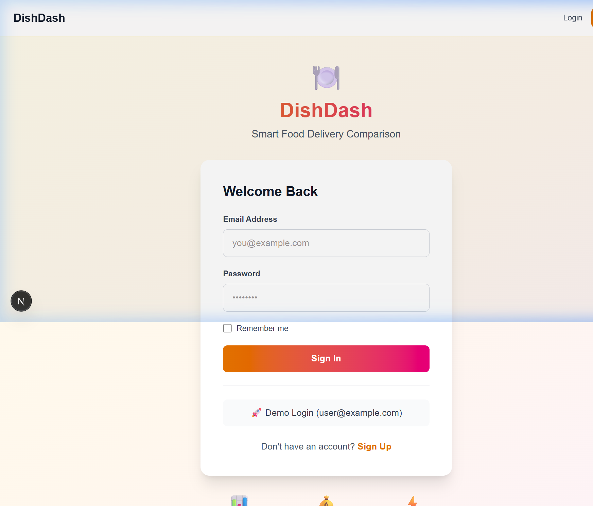
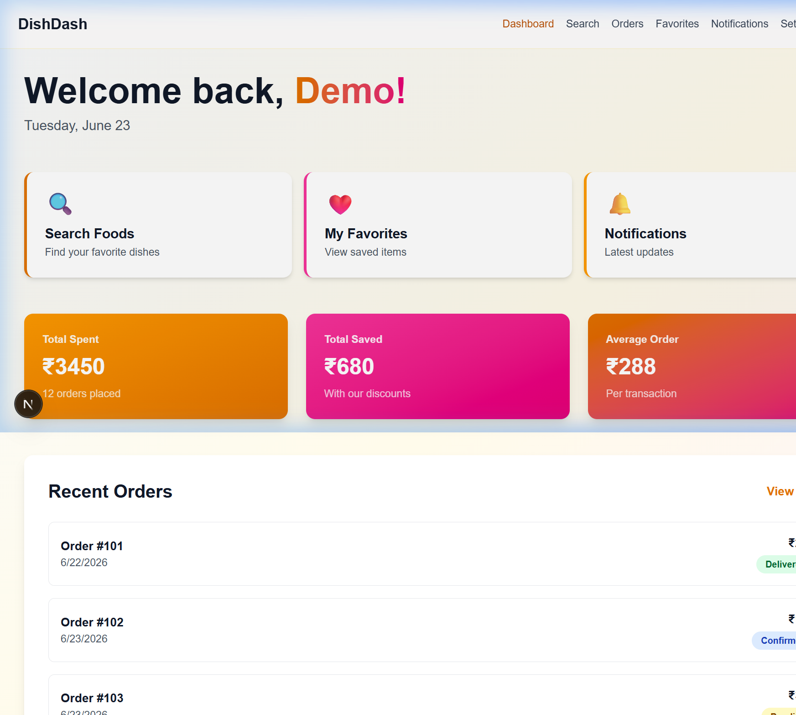
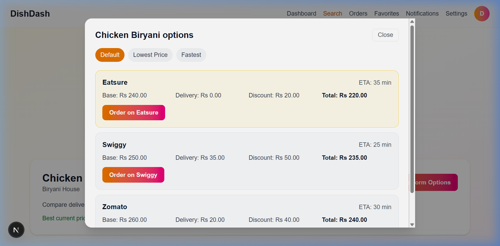
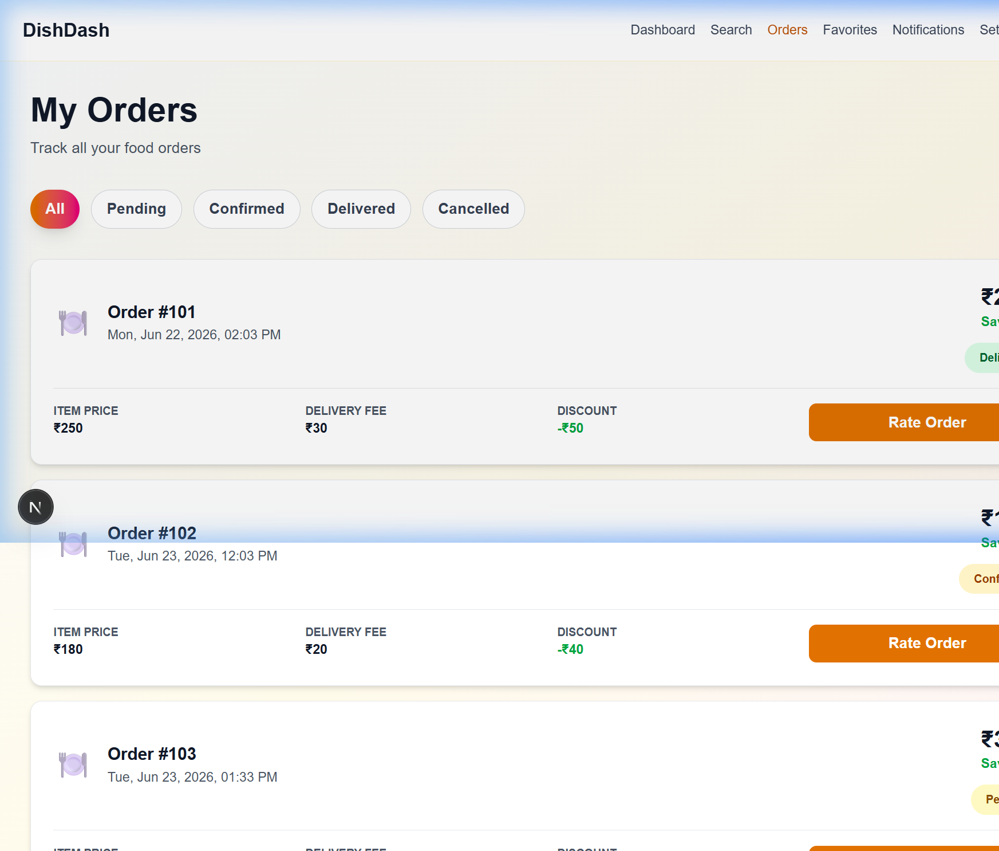

# 🍽️ DishDash - Smart Food Delivery Comparison & Management System

[](https://nextjs.org/)
[](https://react.dev/)
[](https://expressjs.com/)
[](https://www.typescriptlang.org/)
[](https://sequelize.org/)
[](https://www.mysql.com/)

**DishDash** is a modern, high-performance, full-stack food delivery aggregator and analytics platform. It allows users to search for dishes and compare real-time pricing, delivery fees, discounts, and ETAs across major delivery platforms like **Swiggy**, **Zomato**, and **Eatsure** in a single consolidated interface. 

With interactive dashboards, custom analytics, order tracking, and dynamic pricing comparisons, DishDash is designed to optimize user ordering choices and maximize savings.

---

## 🌐 Live Preview

* **Interactive Preview Link (GitHub Pages)**: [DishDash Live Demo](https://rushikeshpattiwar.github.io/DishDash-Food-App-Management-System)
* **Backend Status Health Check**: `http://localhost:5000/health` (Local Instance)

> [!TIP]
> **Static Hosting / Offline Mock Mode**: DishDash features a built-in **global fetch interceptor (Mock Mode)**. When deployed to static servers (like GitHub Pages) or when the backend database is offline, the frontend automatically falls back to a rich mock dataset. You can log in using the **Demo Login** button on the sign-in page to explore all dashboard, search, and orders functionalities immediately!

---

## 📸 Screenshots

### 1. Welcome & Authentication
A premium login page featuring a dual-gradient background, sleek inputs, and one-click demo login access.


### 2. User Analytics Dashboard
A modern analytics hub displaying key performance indicators (total spent, total saved, average order value) and quick action routes.


### 3. Smart Search & Platform Comparison
Real-time comparison search with filters for sorting by lowest price or fastest delivery across major food apps.


### 4. Interactive Order History
Comprehensive tracking of previous orders complete with status indicators, cost breakdown, and rating action hooks.


---

## ✨ Core Features

* 🔍 **Smart Delivery Aggregator**: Real-time cross-platform price comparison of menu items (base price + delivery fee - flat/percentage discounts).
* 📊 **Savings Analytics**: Clear visual metrics tracking cumulative user expenditures, savings, and order behavior.
* 📦 **Order Lifecycle Tracking**: Monitor order flows through status stages (`pending`, `confirmed`, `delivered`, `cancelled`).
* 🔐 **Secure JWT Authentication**: Role-based access control, profile updates, and active session validation.
* 🌓 **Premium Design & Aesthetics**: Built on a modern CSS design system with Outfit & Inter typography, glassmorphic elements, and Framer Motion micro-animations.
* 🛠️ **Seamless Mock Mode**: Zero-break static hosting capability for easy presentation and recruiting reviews.

---

## 🏗️ Technology Stack

| Layer | Technologies Used | Description |
|---|---|---|
| **Frontend** | React 19, Next.js 16, TypeScript, TailwindCSS, Framer Motion, Recharts | Component-driven, responsive UI with animations and dashboard charts |
| **Backend** | Node.js, Express.js, TypeScript | RESTful API server with modular controllers and routes |
| **Database** | MySQL, Sequelize ORM | Relational schema with migrations and pre-populated sample datasets |
| **Integrations** | Python, FastAPI, Uvicorn | External price scraping and middleware connector |

---

## 📂 Project Structure

```
DishDash-Food-App-Management-System/
├── database/               # Database SQL files (schemas, indexes, sample datasets)
│   ├── complete_setup.sql  # Combined schema initialization
│   └── add_features.sql    # Extended table features (analytics, user ratings)
├── docs/                   # Auxiliary documentation & asset files
│   └── screenshots/        # Project UI screenshots
├── frontend/               # Next.js 16 Frontend Web Application
│   ├── app/                # Page routing, analytics, orders, dashboard
│   ├── components/         # Shared UI components
│   └── lib/                # API helpers, global fetch interceptor, auth provider
├── src/                    # TypeScript Express Backend API
│   ├── config/             # Database connection setup
│   ├── controllers/        # Express request handling & logic
│   ├── models/             # Sequelize database models
│   └── routes/             # API routes definition
├── scraper/                # Python web scraper component
└── integration-service/    # Integration middleware API
```

---

## 🚀 Getting Started

### 1. Prerequisites
* Node.js (v18+)
* MySQL Server (v8+)

### 2. Environment Configuration
Create a `.env` file in the root directory:
```env
PORT=5000
MYSQL_HOST=localhost
MYSQL_USER=root
MYSQL_PASSWORD=your_password
MYSQL_DATABASE=food_delivery
JWT_SECRET=your_jwt_secret
```

Create a `/frontend/.env.local` file:
```env
NEXT_PUBLIC_API_BASE_URL=http://localhost:5000
NEXT_PUBLIC_API_TIMEOUT=10000
```

### 3. Database Initialization
```bash
# Run the database setup script to compile schemas & seed data
npm run db:setup
```

### 4. Run Backend Server
```bash
# Install backend dependencies
npm install

# Compile TypeScript and run developer server
npm run build
npm run dev
```

### 5. Run Frontend Server
```bash
# Navigate to frontend and install dependencies
cd frontend
npm install --force

# Launch dev server (Webpack mode for Windows compatibility)
npx next dev --webpack
```

Visit [http://localhost:3000](http://localhost:3000) to view the application locally.

---

## 📈 Performance & SEO Highlights

* **Speed Index**: Optimized component bundle loading using Next.js route pre-fetching.
* **Responsive Layouts**: Designed mobile-first using flexible CSS grids and flexbox.
* **SEO Friendly**: Structured semantic HTML tags, unique browser viewport descriptions, and rich meta-tags on all routes.
* **Optimized Queries**: Relational database indexes set on product name lookups and platform listings.

---

## 🤝 Open Source & Contributions
Contributions are welcome! Please review the developer guides in [docs/](docs/) for information on setting up migrations and API integrations. Feel free to open an issue or submit a pull request.

---

## 📄 License
This project is licensed under the MIT License - see the [LICENSE](LICENSE) file for details.

---

## 👤 Developer Contact
* **Name**: Rushikesh Pattiwar
* **Email**: Rushikeshpattiwar10@gmail.com
* **GitHub**: [github.com/RushikeshPattiwar](https://github.com/RushikeshPattiwar)
